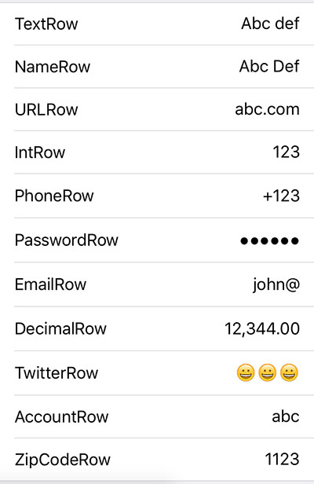

##Form Object

| key | type | Values | description |
|:---|:---:|:---:|:---|
| `title` | *String* | `Any` | Title of Form. |
| `sections`\* | *Array<Section>* | `Any` | An array of sections in form. |
| `locale` | *Locale* | `Any` | Language of form, like `en_US` or `fa_IR`. Also determines left-to-right or right-to-left direction **Unimplemented** |

##Section Object

| key | type | Values | description |
|:---|:---:|:---:|:---|
| `type`\* | *String* | `static`\*, `dynamic` | Section type, see below. |
| `items`\* | *Array<Row>* |`Any`| An array of rows. |
| `dynamic.allowed.delete` | *Bool* | `true`, `false`\* | Allow deleting row in a Dynamic Section. |
| `dynamic.allowed.insert` | *Bool* | `true`, `false`\* | Allow inserting new row in a dynamic section. |
| `dynamic.allowed.reorder` | *Bool* | `true`\*, `false` | Allow reordering rows in a dynamic section. |
| `dynamic.title.insert` | *String* | `Any` | Insert button title. |
| `dynamic.id.prefix`\* | *String* | \*`default`, `Any` | ID's Prefix of newly created field, followed by an underscore and a UUID string. e.g. `receipt_48BE90846BEE4ED4B0923F82A8BD37F3`. Only requried when section is dynamic. |
| `dynamic.*` | *Variable* | `Any` | See **Row** object description for allowed parameters. |

Dynamic sections allow insertion, deletion and reordering rows. Suitable for multiple value inputs, like receipts.

#####Exmaple of dynamic form

##Row Object

Rows can have many types. Here we discuss general parameters for row struct and you can then see specific type of rows and their related settings.

| key | type | Values | description |
|:---|:---:|:---:|:---|
| `type`* | *String* | *See below* | Row type, see below. |
| `id`, `tag`* | *String* | `Any` | Field ID, used when setting and retreiving values. |
| `title` | *String* | `Any` | Title of row shown to user. |
| `hidden` | *Bool*, *PredicateString* | `true`, `false`\*, `Any` | A literal boolean or an NSPredicate string, see below for predicate format. |
| `disabled` | *Bool*, * PredicateString* | `true`, `false`\*, `Any` | A literal boolean or an NSPredicate string, see below for predicate format. |
| `color.background`, `color.background.ios` | *HexColorString* | `#FFFFFF` | Color of row's background. |
| `color.text`, `color.text.ios` | *HexColorString* | `#FFFFFF` | Color of title text. |
| `color.text.detail`, `color.text.detail.ios` | *HexColorString* | `#FFFFFF` | Color of value text. |

### Row (Controls) Object

Row types that allow user to input data. Row types including: `label`, `button`, `check`, `switch`, `slider`, `stepper`.

| key | type | Values | description |
|:---|:---:|:---:|:---|
| `value.minimum` | *Int, Float* | `Any`, `0`\* | Minimum allowed value for ranged controls like slider or stepper. |
| `value.maximum` | *Int, Float* | `Any`, `10`\* | Maximum allowed value for ranged controls like slider or stepper. |
| `value.stepper.steps` | *Unsigned Int* | `Any`, `1`\* | Value added or decreased after tapping on stepper buttons. |
| `value.stepper.type` | *String* | `integer`, `float`\* | **Stepper row** Should show decimal fraction in value or not. Returned value will be always float. |
| `button.pushtype` | *Bool* | `true`, `false`\* | Detemines either show regular button or arrow accessory button |

### Row (Field) Object

Row types that allow user to input data. Row types including: `text`, `textarea`, `name`, `password`, `email`, `twitter`, `account`, `zipcode`, `integer`, `decimal`, `percent`, `currency`, `url`, `phone`.

| key | type | Values | description |
|:---|:---:|:---:|:---|
| `placeholder` | *String* | `Any` | Grayed text to user when value is empty. |
| `color.placeholder`, `color.placeholder.ios` | *HexColorString* | `#FFFFFF` | Color of placeholder string. |
| `empty_text` | *String* | `Any` | Text shown to user when field is empty. |
| `formatter` | *Array<Formatter>* | `Any` | An array of **Formatter** struct. |
| `required` | *Bool* | `true`, `false`\* | Either row can be empty or not. |
| `rules` | *Array<Validation>* | `Any` | An array of **Validation** struct. |
| `currency.style` | *String* | `symbol`\*, `iso`, `accounting`, `plural` | Describes formatting when field type is currency, `symbol` result is `$1,000.00`. `iso` result is `1,000.00 USD`. `accounting` reuslt will be inside paranthesis when value is negative. `plural` result will be `1,000.00 US dollars` |
| `currency.locale` | *Locale* | `Locale` | locale identifier string like `en_US` or `fa_IR`, determines currency type and formatting. Default value is determined by user device settings. |

### Row (Date and Time) Object

Row types including: `datetime`.

| key | type | Values | description |
|:---|:---:|:---:|:---|
| `style` | *String* | `date`, `time`, `datetime`\*, `countdown` | Determines date component to be selected by user. |
| `style.display` | *String* | `popup`\*, `inline`, `picker` |Style of selecting date. `oppup` style will show an popup alert, `inline` will extend row when selecting. `picker` row is extended already.|
| `value.minimum` | *ISO 8601 DateString* | `Any` | Minimum allowed value for date. |
| `value.maximum` | *ISO 8601 DateString* | `Any` | Maximum allowed value for date. |
| `minute_interval` | *Int* | `Any`, `1`\* | Interval between minutes when selecting date. |
| `date.format` | *String* | `Any` | Format of shown date, see [this guide](http://www.unicode.org/reports/tr35/tr35-31/tr35-dates.html#Date_Format_Patterns). |
| `date.calendar` | *String* | `gregorian`, `persian`, `islamic` | Type of calendar to be used. Default value is determined by user device settings. |
| `date.timezone` | *String* | `Any` | Timezone of date, like `Asia/Tehran`. Default value is determined by user device settings. see [this guide](http://www.unicode.org/cldr/charts/29/supplemental/zone_tzid.html). |
| `date.locale` | *Locale* | `Locale` | locale identifier string like `en_US` or `fa_IR`, determines date formatting. Default value is determined by user device settings. |

### Row (options) Object

| key | type | Values | description |
|:---|:---:|:---:|:---|
| `style` | *String* | `alert`, `action`, `push`\*,`segmented`, `picker`, `picker.multiple`, `picker.inline` | See below for a demonstration of each style. |
| `title.selector` | *String* | `Any` | Title of selector form if shown. |
| `options`\* | *Array<String>* | `Any` | An array of string which provide values to be populated with.  Values must be unique. |
| `options.display` | *Dictionary<String, String>* | `Any` | A dictionary of string->string which provide values to be shown to user corresponding to options array. |

### Row (custom) Object

There are several kind of rows to be implemented:

`location`,
`image`,
`attachment`,
`push.async`,
`webview`

### Validation Object

| key | type | Values | description |
|:---|:---:|:---:|:---|
| `message` | *String* | `Any` | Error message shown to user. |
| `regexp` | *String* | `Any` | Regular expression to validate value. Either this field or `predicate` must be set. |
| `predicate ` | *PredicateString* | `Any` | Regular expression to validate value. Either this field or `regexp ` must be set. Predicate should be evaluated against `SELF`. e.g. `SELF < 10` or `SELF BEGINSWITH[c] 'hello'` |

### Formatter Object

| key | type | Values | description |
|:---|:---:|:---:|:---|
| `type`\* | *String* | `number`, `date`, `byte` | Grayed text to user when value is empty. Below settings are detemined according to type. |
| `number.format` | *String* | `Any` | Format of number, like `,##0.0`, for positive and negative values. `¤` is currency symbol placeholder |
| `number.format.positive` | *String* | `Any` | Format of number, like `,##0.0`, for positive values. |
| `number.format.negative` | *String* | `Any` | Format of number, like `,##0.0`, for negative values. |
| `number.symbol.zero` | *String* | `Any`, `0`\* | Value shown when number is literal zero. |
| `number.symbol.currency` | *String* | `Any` | Currency text like `$` or `﷼`, must be empty for normal numbers. |
| `number.rounding_mode` | *String* | `ceiling`, `floor`, `down`, `up`, `halfEven`\*, `halfDown`, `halfUp` | Determines how to round number. |
| `date.format` | *String* | `Any` | Format of shown date, see [this guide](http://www.unicode.org/reports/tr35/tr35-31/tr35-dates.html#Date_Format_Patterns). |
| `date.calendar` | *String* | `gregorian`, `persian`, `islamic` | Type of calendar to be used. Default value is determined by user device settings. |
| `date.timezone` | *String* | `Any` | Timezone of date, like `Asia/Tehran`, see [this guide](http://www.unicode.org/cldr/charts/29/supplemental/zone_tzid.html). |
| `date.locale` | *Locale* | `Locale` | locale identifier string like `en_US` or `fa_IR`, determines date formatting. Default value is determined by user device settings. |

##Row Demonstrate

##### Alert

##### Action

##### Push

##### Multiple Selector

##### Segmented

##### Picker, InlinePicker

