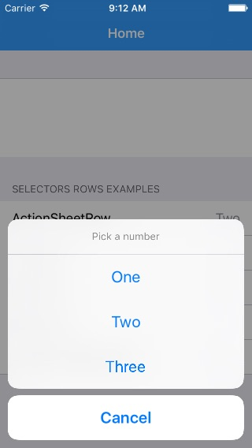

# Dynamic Form Guide

File format is json or bjson.

## Form Object

| key | type | Values | description |
|:---|:---:|:---:|:---|
| `title` | *String* | `Any` | Title of Form. |
| `sections`\* | *Array\<Section\>* | `Any` | An array of sections in form. |
| `locale` | *Locale* | `Any` | Language of form, like `en_US` or `fa_IR`. Also determines left-to-right or right-to-left direction **Unimplemented** |
| `onchange.submit` | *Bool* | `true`, `false`\* | Submitting values when changing values. |
| `onchange.submit.include.visible` | *Bool* | `true`\*, `false` | In `onchange.submit`, tells send user data to be sent to server. |
| `onchange.submit.include.hidden` | *Bool* | `true`, `false`\* | In `onchange.submit`, tells send user data that are hidden to be sent to server. |
| `style.css` | *String* | `Any` | URL of css styling file for web view. |

## Section Object

| key | type | Values | description |
|:---|:---:|:---:|:---|
| `type`\* | *String* | `static`\*, `dynamic` | Section type, see below. |
| `items`\* | *Array\<Row\>* |`Any`| An array of rows. |
| `class` | *String* | `Any` | Class attribute in html output for CSS styling. Default is `"sectionObject." + type` if not set. |
| `dynamic.allowed.delete` | *Bool* | `true`, `false`\* | Allow deleting row in a Dynamic Section. |
| `dynamic.allowed.insert` | *Bool* | `true`, `false`\* | Allow inserting new row in a dynamic section. |
| `dynamic.allowed.reorder` | *Bool* | `true`\*, `false` | Allow reordering rows in a dynamic section. |
| `dynamic.insert.title` | *String* | `Any` | Insert button title. |
| `dynamic.id.prefix`\* | *String* | `default`\*, `Any` | ID's Prefix of newly created field, followed by an underscore and a UUID string. e.g. `receipt_48BE90846BEE4ED4B0923F82A8BD37F3`. Only requried when section is dynamic. |
| `dynamic.row` | *Row* | `Any` | See **Row** object description for allowed parameters. |

Dynamic sections allow insertion, deletion and reordering rows. Suitable for multiple value inputs, like receipts.

##### Exmaple of dynamic form

## Row Object

Rows can have many types. Here we discuss general parameters for row struct and you can then see specific type of rows and their related settings.

| key | type | Values | description |
|:---|:---:|:---:|:---|
| `type`* | *String* | *See below* | Row type, see below. |
| `id`, `tag`* | *String* | `Any` | Field ID, used when setting and retreiving values. |
| `title` | *String* | `Any` | Title of row shown to user. |
| `hidden` | *Bool*, *PredicateString* | `true`, `false`\*, `Any` | A literal boolean or an NSPredicate string, see below for predicate format. |
| `disabled` | *Bool*, *PredicateString* | `true`, `false`\*, `Any` | A literal boolean or an NSPredicate string, see below for predicate format. |
| `class` | *String* | `Any` | Class attribute in html output for CSS styling. Default is `"rowObject." + type` if not set. |
| `color.background`, `color.background.ios` | *HexColorString* | `#FFFFFF` | Color of row's background. |
| `color.text`, `color.text.ios` | *HexColorString* | `#FFFFFF` | Color of title text. |
| `color.text.detail`, `color.text.detail.ios` | *HexColorString* | `#FFFFFF` | Color of value text. |

### Row (Controls) Object

Rows which are simply embed controls such as label or check box.

Row types that allow user to input data. Row types including: `label`, `button`, `check`, `switch`, `slider`, `stepper`.

Value type for `check` and `switch` are `boolean`, for `slider` and `stepper` are `float`.

| key | type | Values | description |
|:---|:---:|:---:|:---|
| `value.minimum` | *Int, Float* | `Any`, `0`\* | Minimum allowed value for ranged controls like slider or stepper. |
| `value.maximum` | *Int, Float* | `Any`, `10`\* | Maximum allowed value for ranged controls like slider or stepper. |
| `value.stepper.steps` | *Unsigned Int* | `Any`, `1`\* | Value added or decreased after tapping on stepper buttons. |
| `value.stepper.type` | *String* | `integer`, `float`\* | **Stepper row** Should show decimal fraction in value or not. Returned value will be always float. |
| `action` | *Action* | `Any` | **(Unimplemented)** Detemines action done when tapping row. |

### Row (Field) Object

Rows which allow user to input data.

Row types that allow user to input data. Row types including: `textfield` and `textarea`.

Value type is conformed to style and can be either `int` or `float` or `string`.

| key | type | Values | description |
|:---|:---:|:---:|:---|
| `style` | *String* | `text`\*, `name`, `password`, `email`, `twitter`, `account`, `zipcode`, `integer`, `decimal`, `percent`, `currency`, `url`, `phone` | Usable when type is `textfield`. Determines entry data type. Affects keyboard shown to user and validation. |
| `placeholder` | *String* | `Any` | Grayed text to user when value is empty. |
| `color.placeholder`, `color.placeholder.ios` | *HexColorString* | `#FFFFFF` | Color of placeholder string. |
| `empty_text` | *String* | `Any` | Text shown to user when field is empty. |
| `formatter` | *Formatter* | `Any` | An array of **Formatter** struct. |
| `required` | *Bool* | `true`, `false`\* | Either row can be empty or not. |
| `rules` | *Array\<Validation\>* | `Any` | An array of **Validation** struct. |
| `currency.style` | *String* | `symbol`\*, `iso`, `accounting`, `plural` | Describes formatting when field type is currency, `symbol` result is `$1,000.00`. `iso` result is `1,000.00 USD`. `accounting` reuslt will be inside paranthesis when value is negative. `plural` result will be `1,000.00 US dollars` |
| `currency.locale` | *Locale* | `Locale` | locale identifier string like `en_US` or `fa_IR`, determines currency type and formatting. Default value is determined by user device settings. |

### Row (Date and Time) Object

Rows which allows user to input date or/and time.

Row types including: `datetime`.

Value type is Microsoft JSON format which is `"/Date(number)"` and number is POSIX time * 1000 (miliseconds passed from epoch Jan 1, 1970).

| key | type | Values | description |
|:---|:---:|:---:|:---|
| `style` | *String* | `date`, `time`, `datetime`\*, `countdown` | Determines date component to be selected by user. |
| `style.display` | *String* | `popup`\*, `inline`, `picker` |Style of selecting date. `oppup` style will show an popup alert, `inline` will extend row when selecting. `picker` row is extended already.|
| `value.minimum` | *ISO 8601 DateString* | `Any` | Minimum allowed value for date. |
| `value.maximum` | *ISO 8601 DateString* | `Any` | Maximum allowed value for date. |
| `minute_interval` | *Int* | `Any`, `1`\* | Interval between minutes when selecting date. |
| `date.format` | *String* | `Any` | Format of shown date, see [this guide](http://www.unicode.org/reports/tr35/tr35-31/tr35-dates.html#Date_Format_Patterns). |
| `date.calendar` | *String* | `gregorian`, `persian`, `islamic` | Type of calendar to be used. Default value is determined by user device settings. |
| `date.timezone` | *String* | `Any` | Timezone of date, like `Asia/Tehran`. Default value is determined by user device settings. see [this guide](http://www.unicode.org/cldr/charts/29/supplemental/zone_tzid.html). |
| `date.locale` | *Locale* | `Locale` | locale identifier string like `en_US` or `fa_IR`, determines date formatting. Default value is determined by user device settings. |

### Row (Options) Object

Rows which. allow user to select one or more item from several options.

Row types including: `options`.

Value type is `string` or an array of `string` for multi-select styles.

| key | type | Values | description |
|:---|:---:|:---:|:---|
| `style` | *String* | `alert`, `action`, `push`\*,`segmented`, `picker`, `picker.multiple`, `picker.inline`, `suggestion`, `token` | See below for a demonstration of each style. |
| `style.accessory` | *Bool* | `false`\*, `true` | For `suggestion` and `token` styles, determine how options presents. |
| `options.title` | *String* | `Any` | Title of selector form if shown. |
| `options`\* | *Array\<String\>* | `Any` | An array of string which provide values to be populated with.  Values must be unique. |
| `options.queryurl`\*\* | *URLString* | `Any` | **Only for `suggestion` and `token` styles** An url which allows fetch options dynamically via url. `%s` represent query-encoded search query and `%max` represents number of maximum results. Results are embeded in JSON object in `results` key. |
| `options.display` | *Dictionary\<String, String\>* | `Any` | A dictionary of string->string which provide values to be shown to user corresponding to options array. |

### Row (Location) Object

Row which allows user to select/view a location on map.

Row types including: `location`.

Value type is a dictionary consists of `lat` for latitude, `long` for longitude, `alt` for altitude and optionally `date`.

### Row (Postal Address) Object

Rows which allow user to input an address to a location.

Row types including: `postaladdress`.

Value type is a dictionary consists of optional `street`, `state`, `postalCode`, `city`, `country`.

### Row (HTML) Object

Rows which show user a rich text.

Row types including: `html`.

Value type is a `string` consists of html string.

| key | type | Values | description |
|:---|:---:|:---:|:---|
| `editable` | *Bool* | `false`, `true`\* | Determines either user can edit contents or can only view. |

### Row (Expression) Object

A dynamic field that is updated by value of other fields and can be used to have an aggregation label.

Row types including: `expression`.

Value type is variable.

| key | type | Values | description |
|:---|:---:|:---:|:---|
| `expression` | *ExpressionString* | `Any` | Similiar to Predicate string, but supports of arithmetic and aggregative operations. |

### Row (Expression Query) Object

Sends a query to specified url then uses returned json result in the value of `result` key to populate row value (AJAX). Request is sent every time user changes value of specified rows. the query is a json dictionary. values id is determinable as `__id` key.

Row types including: `expression.query`.

| key | type | Values | description |
|:---|:---:|:---:|:---|
| `url` | *String* | `Any` | An url which allows fetch result dynamically. |
| `rows` | *Array\<String\>* | `Any` | An array populated with id of rows necessary to have a result. |
| `predefinations` | *Dictionary\<String\, Any\>* | `Any` | A dictionary which is sent untouched every time to server. |

### Row (unimplemented) Object

There are several kind of rows to be implemented:

- [ ] `image`
- [ ] `attachment`

## Validation Object

| key | type | Values | description |
|:---|:---:|:---:|:---|
| `message` | *String* | `Any` | Error message shown to user. |
| `regexp` | *String* | `Any` | Regular expression to validate value. Either this field or `predicate` must be set. |
| `predicate ` | *PredicateString* | `Any` | Regular expression to validate value. Either this field or `regexp ` must be set. Predicate should be evaluated against `SELF`. e.g. `SELF < 10` or `SELF BEGINSWITH[c] 'hello'` |

## Formatter Object

| key | type | Values | description |
|:---|:---:|:---:|:---|
| `type`\* | *String* | `number`, `date`, `byte` | Grayed text to user when value is empty. Below settings are detemined according to type. |
| `number.format` | *String* | `Any` | Format of number, like `,##0.0`, for positive and negative values. `¤` is currency symbol placeholder |
| `number.format.positive` | *String* | `Any` | Format of number, like `,##0.0`, for positive values. |
| `number.format.negative` | *String* | `Any` | Format of number, like `,##0.0`, for negative values. |
| `number.symbol.zero` | *String* | `Any`, `0`\* | Value shown when number is literal zero. |
| `number.symbol.currency` | *String* | `Any` | Currency text like `$` or `﷼`, must be empty for normal numbers. |
| `number.rounding_mode` | *String* | `ceiling`, `floor`, `down`, `up`, `halfEven`\*, `halfDown`, `halfUp` | Determines how to round number. |
| `date.format` | *String* | `Any` | Format of shown date, see [this guide](http://www.unicode.org/reports/tr35/tr35-31/tr35-dates.html#Date_Format_Patterns). |
| `date.calendar` | *String* | `gregorian`, `persian`, `islamic` | Type of calendar to be used. Default value is determined by user device settings. |
| `date.timezone` | *String* | `Any` | Timezone of date, like `Asia/Tehran`, see [this guide](http://www.unicode.org/cldr/charts/29/supplemental/zone_tzid.html). |
| `date.locale` | *Locale* | `Locale` | locale identifier string like `en_US` or `fa_IR`, determines date formatting. Default value is determined by user device settings. |

## Action Object

| key | type | Values | description |
|:---|:---:|:---:|:---|
| `type`\* | *String* | `submit`, `push`, `modal`, `detail`, `open_url`, `share`, `builtin` | Type of child form. `detail` can be used as sub-form. |
| `id`\* | *String* | `Any` | In `submit` its the id of remote action. In `push`, `modal`, `detail` its the id of child form in form of POSIX hierarchy, spearated by `/`. In `builtin` it points to builtin function name. |
| `submit.reload` | *Bool* | `true`, `false`\* | Reloading data from server after submit action sent. |
| `submit.include.visible` | *Bool* | `true`\*, `false` | In `submit`, tells send user data to be sent to server. |
| `submit.include.hidden` | *Bool* | `true`, `false`\* | In `submit`, tells send user data that are hidden to be sent to server. |
| `url` | *String* | `Any` | url to be loaded when tap. |
| `share.data` | *Base64* | `Any` | Base64 encoded data to be shared with other apps. |
| `builtin.arguments` | *Dictionary\<String, Any\>* | `Any` | Arguments of builtin functions. |

## Row Demonstrate

##### Alert

##### Action

##### Push

##### Multiple Selector

##### Segmented

##### Picker, InlinePicker

